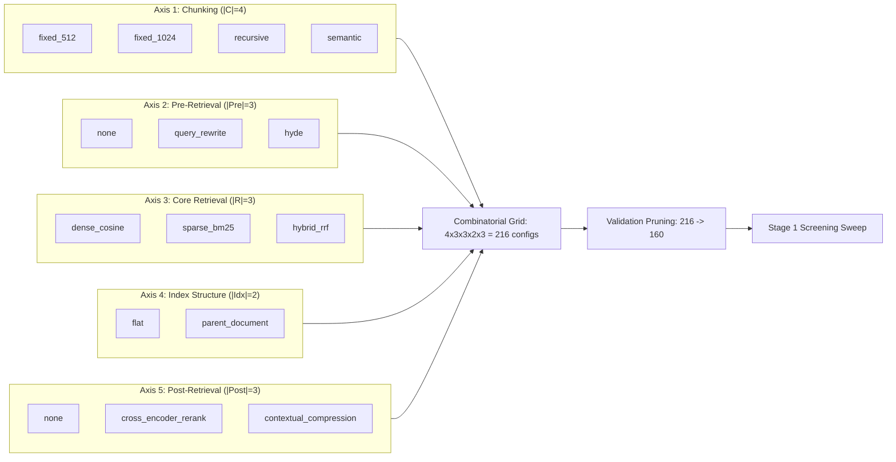
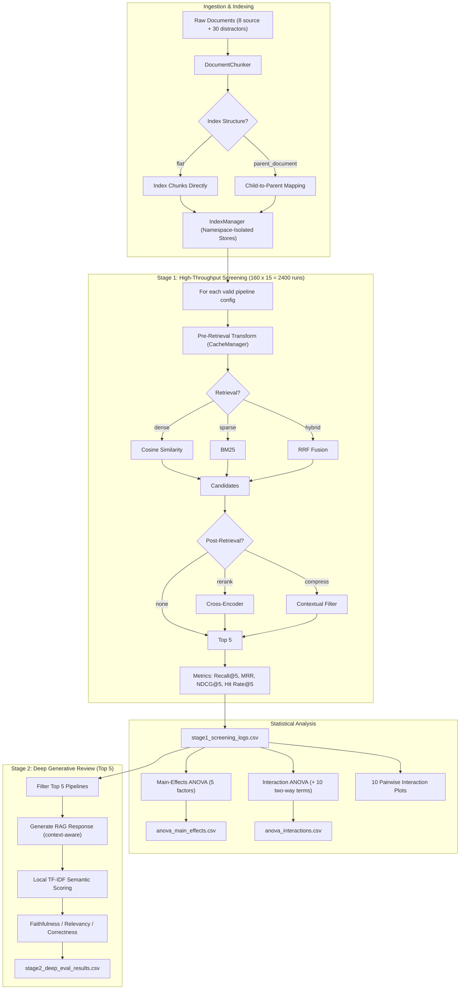

# Implementation Plan - Modular RAG Benchmarking Framework

This document outlines the design and implementation strategy for building the modular, two-stage cascaded RAG benchmarking framework.

## 5-Axis Combinatorial Research Design

### Pruning Rules
| Rule | Condition | Reason |
|---|---|---|
| **1** | `hyde` + `sparse_bm25` | HyDE synthetic narratives collapse lexical BM25 matching |
| **2** | `parent_document` + `contextual_compression` | Compression strips the context padding that parent-doc indexing provides |

## Pipeline Execution Flow

## 1. Storage Isolation Design in `index_manager.py`

To isolate the storage of various chunking and indexing combinations during the 216-loop screening sweep, we will implement **Structured Tag Namespaces** within `IndexManager`:
- Rather than wiping a single vector collection or keyword index on every loop iteration, `IndexManager` will maintain active collections in dictionaries keyed by a combined identifier: `f"{strategy_name}_{index_structure}"` (e.g., `fixed_512_flat`, `recursive_parent_document`).
- This design ensures that:
  1. **Efficiency**: Indices are built exactly *once* per chunking strategy and index structure. Subsequent loop iterations querying the same structure access the pre-built indices instantly.
  2. **Isolation**: No data leakage occurs between different configurations.
  3. **Simplicity**: No external database process is required. We will implement a lightweight, NumPy-accelerated local vector index and a Python-native BM25 keyword index.

---

## 2. Core Modules & Implementation Strategy

We will implement the following 10 Python files under the `src/` directory:

### 1. `chunkers.py`
- Implements `DocumentChunker` with three splitting algorithms:
  - `split_fixed_window`: Slices text into fixed token-limit chunks with custom overlap.
  - `split_recursive`: Slices structurally using hierarchy (`separators=["\n\n", "\n", " ", ""]`).
  - `split_semantic`: Computes sentence-level embeddings using a local HuggingFace model (`all-MiniLM-L6-v2`), calculates cosine distances between adjacent sentences, and splits where distance shifts exceed the `threshold_percentile`.

### 2. `cache_manager.py`
- Implements `LocalCacheManager` to serialize LLM transformations (`query_rewrite` and `hyde`) once per question.
- Saves cache to `data/pre_retrieval_cache.json` using JSON.
- Provides mock generator fallbacks if no LLM key is configured.

### 3. `index_manager.py`
- Manages local BM25 and dense vector collections using namespace tags.
- Uses `sentence-transformers` (or a local HuggingFace pipeline equivalent) for vector embeddings.
- Supports `parent_document` structure by maintaining a mapping of child chunk IDs to parent chunk IDs.

### 4. `query_transforms.py`
- Handles runtime query transformations (`none`, `query_rewrite`, `hyde`) by retrieving cached transformations.

### 5. `retrievers.py`
- Implements core retrieval methods:
  - `search_dense`: Standard cosine similarity search.
  - `search_sparse`: BM25 lexical keyword lookup.
  - `fuse_hybrid_rrf`: Interleaves search results using Reciprocal Rank Fusion (RRF).

### 6. `post_processors.py`
- Implements post-retrieval refinement:
  - `rerank_cross_encoder`: Re-ranks retrieved chunks using a local cross-encoder model (or a lightweight equivalent).
  - `compress_contextual_noise`: Sentence-level filtering to retain only highly relevant sentences.

### 7. `stage1_screening.py`
- Coordinates high-throughput evaluation of the combinations.
- Computes IR metrics bounded between `0.0` and `1.0`:
  - **Hit Rate@5**: `1.0` if any target chunk ID is retrieved, else `0.0`.
  - **Recall@5**: Fraction of target chunk IDs successfully retrieved.
  - **MRR (Mean Reciprocal Rank)**: Reciprocal rank of the first relevant chunk.
  - **NDCG@5**: Normalized Discounted Cumulative Gain.
- Evaluates configurations, prunes clashing paths, and logs performance.

### 8. `statistical_analysis.py`
- Runs a Five-Way ANOVA using `statsmodels` to identify the most significant modular axes.
- Generates interaction plots and saves them to `figures/`.

### 9. `stage2_deep_eval.py`
- Executes generative testing on the top 5 pipelines.
- Supports RAGAS-style semantic audits (Faithfulness, Answer Relevancy, Answer Correctness).

### 10. `rag_bench.py`
- Main entry point orchestrating data loading, validation, screening, statistical analysis, and deep generative review.